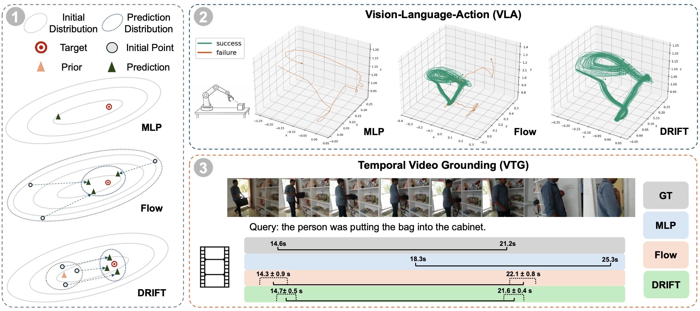

<p align="center">
  
</p>

<h1 align="center">DRIFT: A Residual Flow Adapter for Decoding Continuous Outputs in Vision-Language Models</h1>

<p align="center">
  <a href="#"></a>
  <a href="https://dragonlzm.github.io/DRIFT/"></a>
  <a href="#"></a>
  <a href="#"></a>
</p>

<p align="center">
  <a href="https://dragonlzm.github.io/zhuomingliu.github.io/">Zhuoming Liu</a><sup>1*</sup>, <a href="https://jonneslin.github.io/">Jinhong Lin</a><sup>1*</sup>, <a href="#">Kwan Man Cheng</a><sup>1</sup>, <a href="https://lzhangbj.github.io/">Lin Zhang</a><sup>1</sup>, <a href="#">Shayok Bagchi</a><sup>2</sup>, <a href="https://www.biostat.wisc.edu/~yli/">Yin Li</a><sup>1</sup>
  <p align="center"><sup>1</sup>University of Wisconsin-Madison <sup>2</sup>Independent Researcher <sup>*</sup>Co-first Author</p> 
</p>


## Introduction

DRIFT is a general framework for adapting pretrained vision-language models (VLMs) to tasks that require precise continuous outputs. Many modern VLMs decode discrete tokens, which works well for language-style interfaces but is poorly suited for continuous quantities such as temporal boundaries, spatial coordinates, and robotic control actions.

DRIFT combines a base predictor, which provides a coarse estimate of the target output, with a residual flow refinement module based on flow matching. Instead of learning a global output distribution from scratch, DRIFT models a localized residual distribution around a strong prior, simplifying optimization while preserving the knowledge acquired during pretrained VLM training.

## Highlights

- **Continuous decoding for VLMs:** Adapts discrete autoregressive vision-language backbones to precise continuous prediction tasks.
- **Residual flow refinement:** Uses flow matching to iteratively refine coarse predictions rather than replacing the pretrained model interface.
- **Broad task coverage:** Prepared for VLA, temporal video grounding, and spatial grounding demonstrations.
- **Release slots ready:** Code, Hugging Face artifacts, and arXiv links will be added once public.

## Project Page

The project page is provided in [Here](https://dragonlzm.github.io/DRIFT/). It includes the introduction of the method with quantitative and qualitative results. 

## Citation

```bibtex
@article{drift2026,
  title={DRIFT: A Residual Flow Adapter for Decoding Continuous Outputs in Vision-Language Models},
  author={Liu, Zhuoming and Lin, Jinhong and Cheng, Kwan Man and Zhang, Lin and Bagchi, Shayok and Li, Yin},
  journal={arXiv preprint},
  year={2026}
}
```

## Contact

Please open an issue once the repository is public, or contact the authors for questions about the project.
